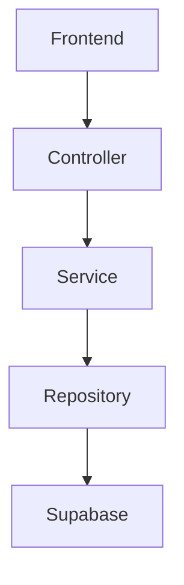

# DOCUMENTATION.md

# Estándar de Documentación

## Objetivo

La documentación es parte del código.

Una funcionalidad no se considera terminada si la documentación correspondiente no ha sido actualizada.

Toda documentación debe mantenerse sincronizada con el estado real del proyecto.

---

# Principios

La documentación debe ser:

- Precisa
- Clara
- Actualizada
- Consistente
- Única (Single Source of Truth)

Evitar duplicar información entre documentos.

Cada tema debe tener un único documento responsable.

---

# Documentación del proyecto

| Documento | Propósito |
|-----------|-----------|
| README.md | Presentación general del proyecto |
| CLAUDE.md | Contexto específico para Claude Code |
| AGENTS.md | Contexto compartido para cualquier agente IA |
| docs/ARCHITECTURE.md | Arquitectura técnica |
| docs/PLAN_DESARROLLO.md | Especificación funcional |
| docs/ESTADO_PROYECTO.md | Estado actual del desarrollo |
| docs/AI_WORKFLOW.md | Flujo de trabajo para agentes IA |
| docs/DECISIONS.md | Decisiones de arquitectura (ADR) |
| docs/standards/TESTING.md | Estrategia de pruebas |
| docs/standards/SECURITY.md | Estándares de seguridad |
| docs/standards/DOCUMENTATION.md | Este documento |

---

# ¿Cuándo actualizar la documentación?

Actualizar la documentación cuando exista cualquier cambio que modifique el funcionamiento del sistema.

Ejemplos:

- nueva funcionalidad
- cambio de arquitectura
- modificación de flujo
- cambio de API
- nuevo módulo
- eliminación de funcionalidades
- nuevas dependencias
- cambios en despliegue
- cambios en seguridad
- cambios en base de datos

---

# ¿Qué documento actualizar?

## Nueva funcionalidad

Actualizar:

- PLAN_DESARROLLO.md
- ESTADO_PROYECTO.md

---

## Cambio de arquitectura

Actualizar:

- ARCHITECTURE.md
- DECISIONS.md

---

## Cambio de flujo IA

Actualizar:

- AI_WORKFLOW.md

---

## Cambios de seguridad

Actualizar:

- SECURITY.md

---

## Cambios en pruebas

Actualizar:

- TESTING.md

---

# Flujo obligatorio

Toda tarea debe seguir este orden:

1. Comprender el requerimiento.

2. Revisar documentación relacionada.

3. Implementar.

4. Validar.

5. Actualizar documentación.

6. Registrar decisiones relevantes.

No cerrar una tarea sin completar el paso 5.

---

# Reglas para escribir documentación

La documentación debe:

- explicar el por qué
- explicar el cómo
- explicar el impacto

Evitar describir únicamente el código.

---

# Estilo

Usar:

- títulos claros
- listas
- tablas cuando aporten claridad
- ejemplos
- diagramas Mermaid cuando sea útil

Evitar:

- texto redundante
- documentación duplicada
- información obsoleta

---

# Diagramas

Cuando un flujo sea complejo, utilizar Mermaid.

Ejemplo:

---

# Registro de decisiones

Las decisiones técnicas importantes deben documentarse.

Ejemplos:

- cambio de arquitectura
- nueva dependencia
- eliminación de módulos
- cambio de estrategia
- decisiones de rendimiento
- decisiones de seguridad

Registrar siempre:

- motivo
- impacto
- fecha
- alternativas consideradas

---

# Responsabilidad

Toda persona o agente que modifique el proyecto es responsable de mantener la documentación actualizada.

No asumir que otro desarrollador lo hará posteriormente.

---

# Checklist

Antes de finalizar una tarea verificar:

□ README actualizado si corresponde

□ PLAN_DESARROLLO actualizado

□ ESTADO_PROYECTO actualizado

□ ARCHITECTURE actualizado

□ DECISIONS actualizado

□ SECURITY actualizado

□ TESTING actualizado

□ AI_WORKFLOW actualizado

□ CLAUDE.md actualizado (si aplica)

□ AGENTS.md actualizado (si aplica)

---

# Definition of Done

Una tarea sólo se considera finalizada cuando:

✓ Código implementado

✓ Validaciones ejecutadas

✓ Documentación actualizada

✓ Arquitectura consistente

✓ Sin deuda documental